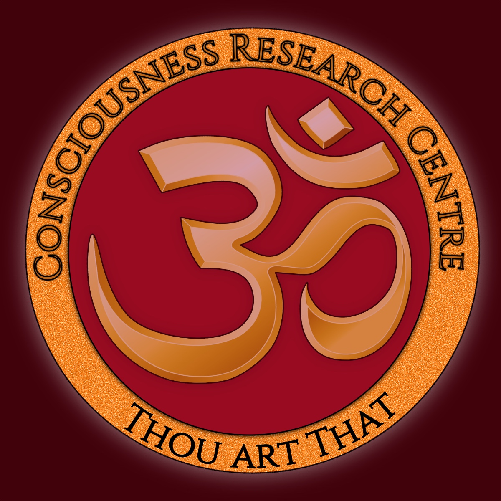

# Welcome to Consciousness Research Centre (CRC)

A living archive of Vedic philosophy, spiritual practice, and reflections on the Self.

For over thirteen years, this project has provided postgraduate-level seminars exploring the Upaniṣads, the Buddha’s teachings, yoga, tantra, astrology, and lived experience of the Self. Nothing here is taught that has not been personally practiced or realized.

---

## Explore the Content

- **YouTube playlists:** [direct links](Videos.md) to video lectures
- **Transcripts of video talks** — organized by [series](Videos.md) and [topic](Videos.md)  
- **Essays and reflections** — commentary on Upaniṣadic and Buddhist philosophy  
- **Charts and reference materials** — practical tools for study  

[Visit the YouTube Channel →](https://www.youtube.com/@ConsciousnessResearch)

---

## Mission

This archive aims to remain **durable, open,** and **searchable**, so seekers can discover insights on the path to *mokṣa,* even if other platforms change. It is a living library, continuously growing as new talks and reflections are added.

---

## Credits

- Primary author: **Dev Bhagavān (Priyānanda Svāmī)**  
- Repository management: **Dinindu Wijenayake**  
- Content shared freely in the spirit of **dharma**

---

## License

All content is under [Creative Commons BY-NC-SA 4.0](https://creativecommons.org/licenses/by-nc-sa/4.0/).  
Free to share and adapt for non-commercial purposes with proper attribution.

---

## Inquiries

Email DevBhagavan@icloud.com or ConsciousnessRC@icloud.com
