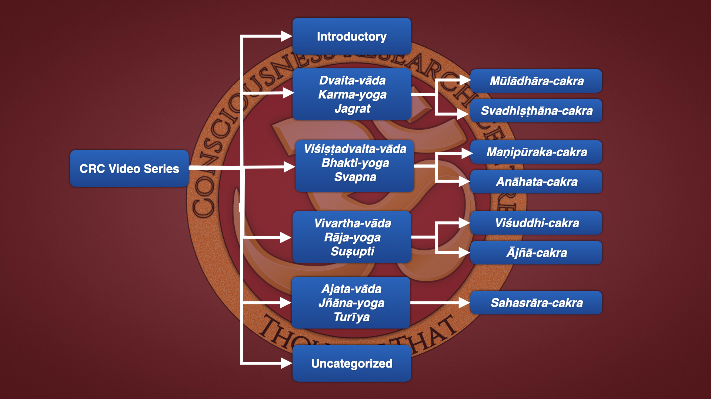

# Transcriptions

The **CRC Video Series** are organized into 4 main categories and 7 subcategories, corresponding to the 4 principal states of consciousness and the 7 *cakras* respectively. The 4 states of consciousness are also associated with the 4 principal philosophical views (*vāda*) and the 4 principal *yogas*. 

These, plus the **Introductory** and **Uncategorized** sections, make 6 categories and 7 subcategories in all:

Here is a tabular view:

| Categories | Subcategories | Description |
| --- | --- | --- |
| Introductory | | Necessary background knowledge |
| *Dvaita-vāda* | | Duality-view & associated consciousness |
| | *Mūlādhāra-cakra* | Issues concerning the Sex *cakra* |
| | *Svādhiṣṭāna-cakra* | Issues concerning the Energy *cakra* |
| *Viśiṣṭādvaita-vāda* | | Qualified nonduality-view & associated consciousness |
| | *Anahata-cakra* | Issues concerning the Emotion *cakra* |
| | *Viśuddha-cakra* | Issues concerning the Speech *cakra* |
| *Vivartha-vāda* | | Illusion-view & associated consciousness |
| | *Ajña-cakra* | Issues concerning the Intellect *cakra* |
| *Ajata-vāda* | | Unborn-view & associated consciousness |
| | *Sahasrāra-cakra* | Issues concerning the Consciousness *cakra* |

## Introductory

| Series | Description |
| --- | --- |
| [Foundation Series](introductory/foundation/index.md) | Necessary background knowledge |
| [Becoming Genius](introductory/BecomingGenius/index.md) | How to master any subject or skill |
| [Being in the World]() | The fundamental human existential problem | 
| [Being Integrity]() | Attaining full human beingness through integrity |
| [Call of the Friend]() | When the aspirant is ready, the teacher appears |
| [Introduction to the Esoteric Teaching]() | The hidden knowledge behind all authentic religious and spiritual teachings and traditions |
| [Consciousness]() | The most ancient theory of consciousness is still the best |
| [Authentic Spiritual Life]() | Real spiritual experience arises spontaneously from within |
| [The Big Picture]() | Beyond narrow-minded sectarian views to the universal |
 
## *Dvaita-vāda* | *Karma-yoga* | *Jagrat* Consciousness

### *Mūlādhāra-cakra* 

| Series | Description |
| --- | --- |
| TBD | TBD |

### *Svādhiṣṭhāna-cakra* 

| Series | Description |
| --- | --- |
| TBD | TBD |

## *Viśiṣṭādvaita-vāda* | *Bhakti-yoga* | *Svapna* Consciousness

### *Maṇipūraka-cakra*

| Series | Description |
| --- | --- |
| TBD | TBD |

### *Anāhata-cakra*

| Series | Description |
| --- | --- |
| TBD | TBD |

## *Vivartha-vāda* | *Rāja-yoga* | *Suşupti* Consciousness

### *Viśuddhi-cakra*

| Series | Description |
| --- | --- |
| TBD | TBD |

### *Ājñā-cakra*

| Series | Description |
| --- | --- |
| TBD | TBD |

## *Ajata-vāda* | *Jñāna-yoga* | *Turīya* Consciousness

### *Sahasrāra-cakra*

| Series | Description |
| --- | --- |
| TBD | TBD |

## Uncategorized

| Series | Description |
| --- | --- |
| TBD | TBD |

