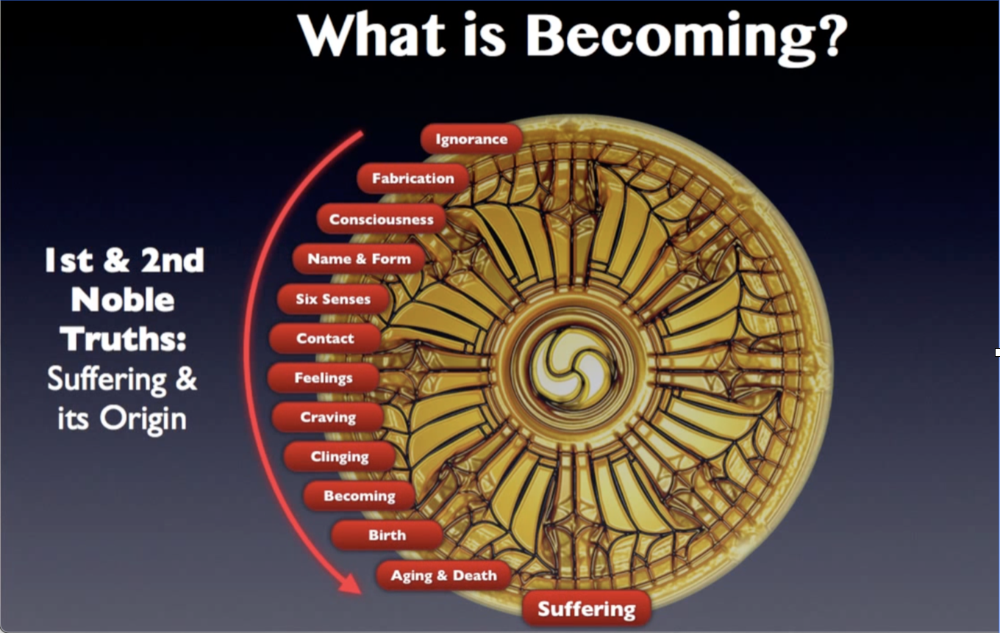
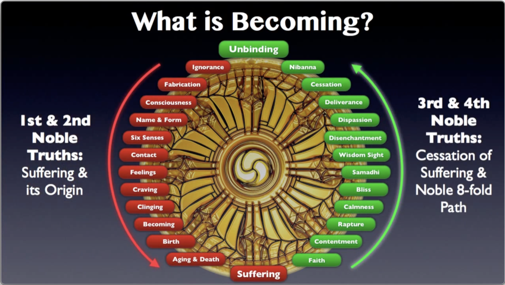
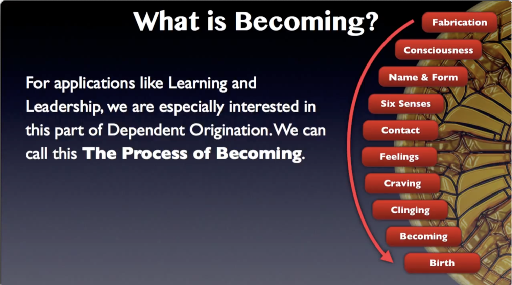

# Becoming Genius

## Episode 0–Introduction

**Transcription**

Dev Priyānanda Svāmī Bhagavān

**Video Link:** [YouTube]((https://www.youtube.com/watch?v=iSn7kk6zRjQ))

## Importance of Learning

**Learning, training** and **education** are probably the **most important factors** that determine **success** and **happiness** in life. Whether it’s ordinary education—reading, writing, arithmetic and all of that—or highly advanced training in some science or engineering discipline—or training in **enlightenment** and **Self-realization**—the ordinary educational system has let us down.

It doesn’t teach **skills**, it only teaches how to give **right answers** on tests. So you wind up graduating from school, only knowing how to get through school. And then you hit the real world, and it’s another story. What is needed to rise above the current crisis in education, in leadership, in trust, and in self-realization, is a **new** kind of education—not ordinary schooling, but **experiential learning** that teaches **real skills.**

## Learning by Being

We cannot master a subject without **doing** it; and we cannot **do** the subject without **being** it. That’s where our Western philosophy has let us down. Descartes’ idea of “I think, therefore I am,” is completely backwards. The Cartesian split between the mind and the body, between knowledge and action, is completely wrong. Why? Because **real learning** starts from **being.** We went over this in the previous videos in the [Foundation Series](https://www.youtube.com/playlist?list=PL8s1kPtHmCZKmgES4E6Lnrqu9Sdt4_786)**,** and we’re going to go into it much deeper in this series of **Becoming Genius**.

Because no one is **born** a genius—or you might say, **everyone** is born a **potential** genius—but why do some people **realize** it and others **don’t**? It’s simply because they are not **becoming** a **genius**. Of becoming a genius, I’m not going to say it’s **easy**—you have to know **how**. But once you know how, it’s simply a matter of the **methodical application** of certain **principles**, and we’re going to go into those principles **deeply** in this series.

If one wants to become a doctor, you have to enroll in **medical school**; you have to go through a lot of book-learning; and **then** you have to go through a lot of **practical** learning. Finally, you have to be **approved, evaluated** and **stamped** a doctor by a panel of **judges**, all of whom are **practicing physicians** themselves.

The same is true of **enlightenment**. You can study **about** enlightenment from books or websites, but unless you actually **practice** and **become** an enlightened person, you will not attain what you’re looking for.

This series of videos is how to **become** a genius in **any field** that you choose. Of course, we would rather that you become a genius in **Skillful Living** and realize the teaching of the Buddha, because that will give you the greatest benefit. So, what is **Skillful Living** and what is **becoming a genius**? Well, let’s talk about it some more.

## Science of Becoming

So in other words, it’s very hard for us to learn new skills, because **our idea of learning** itself is backwards. Let’s go over the theory again: **Being and Becoming**. Becoming is the process of **changing your being.** Now, how important is **being** in learning and life in general? Most people think that **having** is the important thing. If I **have** something, then I can **do** something with it, and then I can **think** about it and then I can **know** something. And then maybe being is in there someplace, down near the bottom. But that’s not the way it **really** is.

The way it **really** is, is that **being** is **fundamental**. If you have the being of, let’s say, an **artist**, then you automatically **know** how to express yourself, and you can think in terms of your artistic media and disciplines and so on. And then you can **easily** do your art, and then you can **have** the things that **come** from doing your art.

Or if you are interested in **leadership,** by having the **being** of a leader, automatically the doing, having and so forth of a leader will **come** to you. And with regard to **enlightenment**, if you can **synthesize** the **being** of an **enlightened person**, then automatically all the rest will be added to you.

In other words, **being** is **senior** to everything else: change your **being** and you change your **life**. If you want to change your life—if you want to **learn** something or **become** something—then you have to change your **being.**

And of course, the problem is we haven’t been **taught** about being. We don’t understand much about **becoming**. These are **foreign words** to us, because our educational system has **buried** topics having to do with **ontology, ontics, phenomenology, experiential learning** and so on. They have put them away where we can’t **get** at them, where we have no **access** to them, where we don’t have the vocabulary to even **approach** them. And mainly they have been relegated to the **graduate** and **postgraduate** levels of education.

So very few people get that far, therefore very few people know about issues concerning **being**. What to speak of **becoming**; becoming is very **esoteric**. Really it’s only covered nicely in the teaching of the Buddha. That’s why we source everything from the _Suttas:_ the _Theravāda Suttas_, which are the original teachings, the original sermons, actually, of the Buddha to his monks.  

## What is Becoming?

Now what is becoming? The dictionary defines **becoming** as a verb, meaning:

> “Begin to be; grow to be; turn into; (of a person) qualify or be accepted as; acquire the status of.” And the example they give is, ‘she wanted to become a doctor’.

Well again, if you want to become a doctor you have to go through the **process** **of becoming** a doctor. It’s not **easy**; it takes a lot of work. **Anything** in life worth doing, is worth doing **well**; and anything in life that’s worth doing well, is worth becoming a **genius** at, becoming a **real expert** at it.

And we’ll define **genius** in a moment, but for now try to understand that **anything worth doing** in life is going to be a **struggle**. It’s going to be a lot of work; it’s going to require a **very strong commitment**, an intense amount of **labor** and **attention** from you.

So we’re talking about **becoming**. OK becoming is a necessary thing for learning, but **how** do we become?

The Buddha tells us. He defines becoming as follows: 

> “_Kamma_ is the field, consciousness the seed, craving the moisture. The consciousness of living beings is **tuned** to a refined property. Thus there is the production of renewed becoming in the future. This is **how** there is becoming.” —_Bhava Sutta_ ([AN 3.76](https://suttacentral.net/an3.76/en/thanissaro))

So the Buddha, as usual, gives us a **deeper** view of becoming than the dictionary. He tells us **how** there is becoming by **tuning the consciousness** to a **refined quality**.

If you understood this statement, it’s like E=mc2. If you understood E=mc2, you could go into the lab and cook up an atomic bomb. Well, if you understand this statement, “The consciousness of living beings is tuned to a refined quality,” you could **become anything** that you would like to become, in this world or **beyond** it. This is the **secret**, and we’re going to be explaining this secret elaborately in this video and the ones following.

## What is Genius?

Now let’s take a look at **genius**. Everybody knows the perfect example of genius: **Albert Einstein**. Albert Einstein was **already** a genius by the time he was 16. He was already doing original work in a very, very esoteric field of Nuclear Physics. **How** did he get like that? Was he **born** that way?

Some people might want you to **think** so. But I **disagree**. I was **also** doing advanced work in physics at the age of 16; in fact I was offered a full scholarship to MIT in Nuclear Physics—which I turned down. But **why** did I get that scholarship? **Why** did I get perfect scores in all my College Board examinations?

I looked into this, because people asked me—my disciples especially, my students asked me—“How is it that you **know** all these things? How is it you can **do** all these things?” I can fly a light plane, I can swim and run, I was a really highly trained _yogī_ and other athletics, and I did so many things in my life that most people don’t even **start** to do. I was an expert symphonic flautist, I was an expert jazz composer, and so many other things; I wrote dozens of books, and so on and so on.

**How** did I do that? Well, when people started asking me, I gave it some thought. How **did** I do that? And the result is what you’re getting in this series: **how to become genius**.

## Becoming a Genius

Becoming a genius is something you **do**; it’s not something you **are**, in the beginning. You have to **cultivate** it; you have to **work** to get it. But luckily there is a **method** that you can follow. It’s not **easy**. It will take a lot of work, and a lot of that will be dry, plodding, methodical work.

But if you follow this method I **guarantee** you, you can **become** a genius at **whatever** you want to do.

So what **is** a genius? Well again, the dictionary defines genius as a noun meaning, “Exceptional intellectual or creative power or other natural ability; a person who is exceptionally intelligent or creative, either generally or in some particular respect.”

The example they give: ‘a musical genius’. Well I disagree with this definition because it says ‘other natural ability’. But I don’t think the abilities of a genius are natural. I think the ability of genius is **cultivated**, and it’s cultivated in a **very specific** way, having to do with the **meaning** of **terms**.

And we’ll get into that when we describe the **four levels** or **four** **steps** of the **process of becoming genius**.

Now we can define becoming genius as follows:

> “**Becoming Genius** utilizes concepts derived from the teaching of the Buddha and other spiritual disciplines, as well as advanced concepts in science, education, ontology, semantics, software and systems theory, to **master** any subject **so thoroughly** that it results in a **permanent change** in **being**; so that whatever you master becomes your **spontaneous, natural self-expression**.”

Now **this** is the **natural** part about being genius: by the time you **become** the **master** of a particular subject or activity, it is **natural** to you to act **as** a master **in** that field. You don’t have to think about it; there’s no planning, thinking, calculating, scheming. You don’t need to take a break and say, “OK what am I going to do now?” It **arises spontaneously** from your **being**. That’s the whole point of **Becoming Genius**.

## Mastery

So when we say ‘a genius is someone who has achieved mastery in a particular field’, what do we mean exactly? Well, the meaning of **mastery** is far more than mere mechanical or technical proficiency. When you master something it becomes **your being**—who you are, your natural self-expression—not something you merely **know about**. Whatever you master becomes **effortless** to use; you don’t need to **remember** and **apply** it; it **becomes** your **natural spontaneous self-expression**—without thinking or calculation.

This level of mastery comes from our unique **ontological model** and **experiential methodology**. The model of being and becoming used in our course is derived from Buddha’s theory of **Dependent Origination** (_paṭicca-samuppāda_).

And we’re going to go into this in detail in our upcoming videos. You will learn how to use Dependent Origination to **become whatever it is** that you want to be. And if you want to master a particular field, **how** to **become** a master of that field. And if you’ve attained that, then that field is completely open to you; whatever you want to do you can do at the highest level.

## Experiential Learning

We mentioned **experiential learning**. Well, what is experiential learning? Becoming Genius will not be easy because we will **critically question** your habitual ways of learning and **point out** what is holding you back. You need **full participation** to get the promise of Becoming Genius: you have to make it part of your **experience**.

So in other words when we read something to you, or when we say something to you in these videos (You should view this video over and over again, by the way.) and each time we introduce a new concept you should stop the video, look into yourself and **recall a time** when you **experienced** something like that in your life. Or if you **never have** experienced something like that, you need to identify **that** too.

If this is a completely new concept that has no equivalent in your experience, then you should be very **attentive** to it, because this is something **beyond** your previous level of being.

We offer a radically different approach to learning. To get the full value of this you must **discover for yourself** the **experience** of what we present. The **experiential method** is designed to **provoke** you to transform **yourself** into the genius you potentially can be.

In other words, I can’t do it to you; **you have to do it to yourself**. You have to work out these ideas **in your experience**. And the primary thing that’s holding you back, is that you **don’t know the definitions** of the **terms** that we’re using to describe our method. And we’ll go over this in great detail coming up in the videos.

Finally, **experiential learning** is not merely knowing about a subject, but **transforming your being** into a master of the subject: a **genius**.

## Communications Cycle

What am I doing when I’m trying to communicate with you? I have an idea, or a memory, or an experience, or a state of consciousness, or some information that I want to get across to you. And I want to have a **copy** of the information in **my** head wind up in **your** head. How do we do that?

We take a **language** that we both understand, and I **encode** my thoughts into the language. The **language** is not the same as the **thought**! It’s a **code**. When I say ‘dog’, everyone thinks of a dog, a four-footed furry animal, and all the qualities of a dog, and so on.

What? Is the word ‘dog’ equivalent to a dog? No! Although you have been taught that in school. If somebody asks, “What’s a four-footed furry beast or the best friend of mankind?” Well d-o-g, and you write that in on your test, then you get **approval** for that. But **no**—knowing a dog, having a dog for a pet, living with a dog and so on… I should have used cat, that would be a better example, I like cats a lot more. **Living** with a cat is a whole different experience than simply **knowing about** cats.

So if I say the word ‘cat’, it means I’m thinking of a cat, and I have **encoded** that thought in a word. Now I’m going to **speak** that word ‘cat’—it goes across to you, you hear it in your ear, and it goes into your brain—and you decode it into what **you** know of cats, into **your** experience of cats.

Your experience might be completely **different** from mine. Maybe you had some mangy old alley cat who gave you fleas. I have a pet **Lion**; so my different experience of cats is going to give me a completely different idea. And when I say ‘cat’—the general word ‘cat’—that gives **me** a different impression, a different idea, a different **concept** than a person who only knows house cats, for example.

Or, one time in India I ran into a wildcat in the mountains. Now **this** is a **cat**, but it’s not like a cat that most people know. So, my idea of cats is probably a lot **bigger** than most people’s idea of cats. My **experience** with cats is a lot bigger than most people’s experience too. So when I say ‘cat’, I have a different meaning than most people will have when they decode that word into their **own** experience.

So that’s why we need to make such detailed explanations of everything, because every single word we use is defined in a **particular way** according to our **intention**. And in order for you to **get** what we’re talking about, the **same** idea has to come up in **your** mind when you decode what we say.

That means we have to **qualify** everything; we have to be very careful about the words we use, so that you can get the **exact same idea** that we have. This is called **duplication**, and it is the principle of communication that we use to impart this teaching.

## Becoming (Dependent Origination)

**Video Link:** [YouTube](https://www.youtube.com/watch?v=ro8MKdAejSw)

Now let’s talk a little more about **becoming**. Becoming is actually the subject of the First and Second Noble Truths of the Buddha. There is **suffering**, and there is an **origin** of suffering. And here is the origin of suffering in a diagram of Dependent Origination.  

It begins with **ignorance**, and then it goes through all these other stages until it finally reaches suffering. So this is how suffering comes to be.

But there’s also the Third and Fourth Noble Truths of the **cessation of suffering**, and the **Noble Eightfold Path**, which is the **method** or the **way** to the cessation of suffering.

Now, even if you don’t know about Dependent Origination, you’re actually using this all the time. The Buddha got this theory from **observation**. He was watching people, he was watching **himself**, and how we **become** something at every moment. **Every moment** this process is going on, on different scales. Sometimes it can happen in a matter of **microseconds**; other times it can happen in minutes or hours, or days or weeks, or maybe even many **lifetimes**—that we go through these different stages, and we become different things, according to our intentions.

There is a law: the **Law of Dependent Origination**, the law of _kamma_ or _karma,_ and this is **how** that law works. It doesn’t require some external authority, like a God who looks over your shoulder every minute and writes down whatever you do. It’s a ridiculous idea—who would want to do that? No! The law of _kamma_ works through our own being; it works through our own brains and the laws of nature. It’s just that Western science is not aware of these subtle laws of **being** and **becoming**. If it were, then we could easily turn this into a very scientific theory and prove it—which, actually, the Buddha has already done.

## Overcoming Suffering

So let’s take this wisdom and use it to overcome the problem of **suffering**. Most people **misuse** the process of Dependent Origination. And so when they **become** something, it winds up in **suffering**. And when they get to suffering they say, “Oh no, I don’t want this suffering! I’ll become something **else**, and that way I won’t suffer…”

So we go back to the beginning, still ignorant of the **Four Noble Truths**, still ignorant of the Laws of Dependent Origination and so on, then they start the whole thing all over again. And that’s why there’s reincarnation. That's why people go “round, round, do it again. Wheel turnin’ round and round—and go back, Jack, do it again,” until you’re sick and tired of it!

And that’s when you approach the teaching of the Buddha. You say, “OK, I’m tired of the suffering. I want it **over**, I want it **finished**,” and at that point you become a candidate for the **Eightfold Path**.

That's why, in our process of Skillful Living, we make frequent references to the teachings of the Buddha. Now times have changed since he gave this teaching, and people’s lives are a lot different now than they were then, at least **externally**. However the **principles of becoming** are still the same, and so we’re going to use these principles, so in the beginning you can achieve satisfaction of being whatever you want, **becoming a genius** in whatever field you want, whatever your interest is, and attaining satisfaction in life. And from there we’ll go on up the Eightfold Path.

## The Process of Becoming

So for our purposes, for applications like learning and leadership, we’re especially interested in this part of Dependent Origination, which we can call the **Process of Becoming**.

The Process of Becoming, as you can see, begins with **Fabrication** and it goes through all these other stages down to **Birth**. Now this can be literal birth, or it can be the birth of an identity; it can be the birth of a self, a way of looking at yourself or life, a point of view or a feeling or anything else.

For the purposes of investigating learning as a process of becoming. however, we will divide the stages a little differently than the Buddha did, because his purpose was to bring people right on to the Eightfold Path. First we have to **cure** your **learning disabilities**. And **then** we can worry about the Eightfold Path because if not, you’re not going to be able to understand it.

So we’re going to work on **curing your learning disabilities** using the Buddha’s technology, so that you can attain the **success** in life that is being **denied** to you by your mis-education, by your **wrong training**, by your years of wrong living and bad experience in this world. We’re going to **turn that around**; and we’re going to show you exactly how to do that.

## Four Stages

**Video Link:** [YouTube](https://www.youtube.com/watch?v=54ZJ8f3UErs)

So the method that we use in **becoming genius** has **four stages**. For any given subject the **first stage is duplication**: making an exact copy of the source materials. If for example we’re going to learn about music, well, we have to go to a book on music and then make an exact copy of that knowledge in our own minds.

Or if we’re going to learn about learning, like we are now, you have to be able, and willing also, to make an **exact copy** of that knowledge in your own mind. And then we can talk meaningfully; then we can have real communication. Then we can actually transfer the **understanding** that we have, and the **abilities** that we have, to you. And then you can exercise and learn those abilities yourself. Or I should say, teach yourself those abilities, because that’s what we’re really talking about here. This is the **method** of **Self Instruction.**

The second stage is **understanding**. And I define that as **systems thinking through logic.** What does that mean? **Systems Thinking** is a discipline of thought where one makes a **dynamic working model** of a subject in one’s mind. You know, having duplicated the subject matter, then one puts it into a model—a **working model** that works the same way as the thing you’re studying itself.

That allows you to **predict** the results of any action by playing with the model. This is how Einstein invented relativity. He made what’s called a _Gedankenexperiment:_ a thought experiment. He set up an experiment in his mind. Einstein came up with Relativity without ever going into a lab! He didn’t do it by experiment; he did it by **thinking**. He had such a perfect model of the universe and the laws of nature in his mind, that at least as far as motion and time and things like that, he was able to model them perfectly, and see “Well what if? What if we did this? What if we did that. What we had something moving near the speed of light? What would happen? What would happen to time and distance, and all these other things?” And he came up with Relativity just by **thinking** about it. **You** can do that too.

The **third stage** is called **analysis**: the **contemplation** of abstract relationships. So we’ve duplicated the subject matter, we made a model internally in our own mind, and now we’re going to **analyze** that model and **abstract** the **relationships** among its pieces. This is an analysis of **ontological relationships**, and we’re going to get to ontology in a minute.

The **fourth stage** is **metacognition.** Metacognition is the realization of a new state of being based on the information that you have duplicated, modeled and analyzed. Metacognition is when **the light goes on**; when you finally say “Ah, I got it,” when your understanding **transcends words** and **symbols** and becomes a **state of being**.

That’s what it’s all about! That’s what we’re getting at, and these four stages show you **how**.

## Levels of Being

I’d like to look at these same four stages from another point of view.

Again for any given subject, the **duplication** is on the **mental** level, the level of **words and symbols**. Here I am talking to you, and you’re hearing my words, and you’re decoding those words and you’re getting an idea of what I’m saying, just by the words and symbols: just by the words I'm speaking and the symbols that you're seeing on the screen. That is an absolute necessity.

If you don’t duplicate, if you don't make an exact copy, if you make a wrong copy, or an imperfect or partial copy of a piece of knowledge, You’re not thinking with all the information, not firing on all cylinders. So you’re not going to get the same result, you’re going to get some different result, and we don’t know what that's going to be, but it's not going to be the same as the original. So you have to start from a perfect copy: **duplication**.

The next stage, **understanding**, is on the **intellectual** level. This is where intelligence comes in. **Modeling** requires intelligence because you have to see, “OK this is the meaning of all these words and symbols that I’ve taken in and duplicated. Now, how does this actually **work**? When I tweak over here, what happens on the other end? What is the relationship of **cause** and **effect**? What **controls** what? What actually does the work here, and **how** does it work?"

Now this gets into the next stage, **analysis**. Analysis is the **ontological** level: what is the **meaning** of these relationships? What is **cause**, what is **effect**? What is a **major** quality and a **minor** quality? What are the different relationships between and among the various parts of my model? Finally, what does it all **mean**?

When you finally understand what it all means, then **metacognition** occurs. And this is the **ontic** level, the level of **being** and **action**. In other words, up until now we’ve been learning, but when you reach metacognition, you have reached **mastery**. You have **become** the thing that you’re studying; it has been absorbed into your **being**, now there’s no more need to **think** about it; you can just **be** it.

## Mastery

You see? This is what we’re talking about: this is **mastery**, this is **being genius**. **Becoming Genius**, you have to go through these other steps. It's a lot of work! I'll be honest with you: it's not for the faint of heart, it’s not for the lazy. You have to be **ambitious**; you have to be **driven**, you have to be **passionate** about something. Find something you really **love**, something that you love enough to do a **lot** of it, because that’s what it’s going to take to get you through all these stages—unless you're extraordinarily intelligent, and you acquire this exactly **by the book**.

Now, if you can do that—if you can go through this process by the book, without questioning or doubting it, but just **do it**—you will find the speed of learning will increase by a factor of maybe a hundred? maybe a thousand? and the **efficiency** of learning will also increase. But most satisfying of all, the **depth** of learning will increase beyond your wildest dreams.

It's one thing to learn that 2 + 2 = 4; it’s quite **another** thing to learn **number theory**, and **why** 2 + 2 = 4. It's quite **another** thing to learn abstract mathematics and ontology, and understand why we **need** concepts like what is the **meaning** of those concepts, and what are the powers and abilities that come from having those concepts. When you get to **that** point, you're ready to have a metacognition—which can't be explained in words, by the way.

If you've never had this happen to you, it means you've never done **enough** of anything, you've never gone **deep** enough into anything to actually make it a part of you, to make it part of your **being**. You're not ready for your being to **change**; you're not ready to **become** a genius in that subject. But when you **do**, you'll know it—believe me. Because it’s an extraordinarily **profound** and **deeply affecting** experience.

When I say the light goes on, I mean that quite literally. The mind becomes **brilliant**; it becomes **effulgent**. Suddenly you can **see** so many things you couldn’t see before. And this is true of everything, from riding a bicycle, all the way up to complete Enlightenment. So this is quite an adventure.

## Becoming Skillful

Let’s review a few things about becoming skillful. The process of **becoming skillful** is a cycle with **three stages**: **practicing**, causing something to arise or to happen—in other words, doing something; **increasing**, developing it by repetition; and finally **investigating**, observing and reflecting upon the practice.

For example, if I’m playing music, I’ll take my instrument and I’ll make a tone, or a scale or a chord. Or I’ll play a song. And then I’ll play it again, and I’ll play it again and again. And finally, I’ll sit down and I’ll reflect, and I’ll say, "Well is that good enough? Is that really what I want? Am I saying what I'm trying to say with this performance? Do I want to adjust things, or change the harmony, change the tempo? Or is it good enough? Or is it **ever** good enough?”

These are the questions you ask yourself when you’re investigating. **Investigating** is by far the most important stage of **developing skillfulness**. It means observing one’s experience, taking it to heart and reflecting on it wisely until you understand and perceive clearly all the phenomena involved in each step of the practice.

This is what it takes to become expert. If you **don’t** become expert in a field, you’re **not** going to reach the highest stage of **becoming** that thing. To simply learn how to play a couple of notes on a synthesizer or program a drum machine is different from becoming a **really expert** musician. Learning to quote from the scriptures is completely different from actually becoming **realized** like a Buddha. These are very different levels of advancement. You should not remain content with a superficial understanding of whatever it is.

If you’re going to become a leader, for example, become a leader of such power and depth that you don't require any position in an organization. In fact, organizations will evolve **around you**, simply by your **presence**, simply by your **being**. Look at the Buddha: the Buddha gave up his position as a prince. He was offered leadership in two very important spiritual organizations—he turned that down as well. And he went off by himself, and he figured out by himself how to attain Buddhahood. And he did it.

And now look—there are whole **countries** that are run by Buddhism. And in the past, there was a whole empire in India—the empire of Emperor Ashoka—that was run according to Buddhist laws. Buddha himself had no position, wanted no position. But he was one of the greatest leaders in history. Or Jesus Christ, or Mohammed or any of the great innovators in science, or anything: they had no position, they had no title. They had no organization.

Einstein was just a kid working as a patent clerk. But because he was such a great scientist, because he was a great leader in his field, a whole discipline of Relativity, of atomic physics and so on, **grew up around** him. That’s the kind of **leadership** we're talking about; that’s the **depth of skill** that we’re aiming for. And we don’t want to accept anything less—and **neither should you**.

## Foundational Knowledge

Now finally I just want to review a little bit about **Skillful Living**. The process of **becoming skillful** should especially be applied to **foundational knowledge**. **Skillful Living** provides foundational knowledge of human life and beingness, as well as techniques for developing that knowledge to a high degree of skillfulness. **Foundational knowledge** is defined as follows:

- It aims at the extinction of the suffering unsatisfactoriness and imperfection of every experience or state of being in the world.
- It has an **intrinsic truth** that you can **see** and **experience** for yourself without having to rely on authority, tradition, logic, philosophy, hearsay and rumor, common sense, preconceived ideas, the social status of the presenter or because you consider yourself the student of the presenter.

These are all dangerous assumptions, because they can lead you to accept an idea on **belief**—on **faith** alone; without testing it, without examining the assumptions behind it; without experiencing it for yourself. **Real learning** only comes from experience. Book learning is just the **appetizer**.

I'm not saying it's not important—it is. But book learning is just the **prelude** to actual learning, because learning requires **growth of being**. And this is the thing that ordinary education has **ruined** in everybody that I know, because ordinary education allows you to become a so-called 'learned' person—with a degree and all kinds of letters after your name—without changing your **being**.

And so they cheat us—they don’t force us to **grow**. And the hardest thing about spiritual teaching, in my experience, is getting students out of this habit, and actually getting them to **grow**: to seek out new experiences; to seek out new ways of being, develop hem themselves. Because no one can do that for you.

It’s like thinking for yourself: nobody can **teach** you how to think for yourself. Nobody, really, can **teach** you how to roller skate. Maybe they can set up **conditions** where you’re **motivated** to learn for yourself; that’s the **best** they can do. And that’s the best **I** can do, by making these videos, or by our Apprenticeship program.

You can become situated in a situation that motivates you to actually learn, to actually change your being. But that's the best we can do. We can communicate to you what a metacognition is. We can talk **about** it, but we can't actually **give** it to you by talking about it, because it can't be spoken in words! It can only be experienced. But when you **experience** it, you’ll **know** it.

And you’ll say, “Whoa. You mean, I went through twelve years of school, or sixteen years of school or whatever it was, and I never had an experience like this. I never had a **growing** experience where I **learned** something about life so profoundly, so **deeply**.”

You can come here to Sri Lanka and go in a temple and study Buddhism for years and years, and **never** have a metacognition about it. It’s quite possible. That’s because **academic learning** does not give **growth of being**. So from the beginning, we are stressing growth in being: **becoming**. And in that way, we’ll get you **really** ready to have a metacognition, to bring **being** to **realization** of the subject matter, and **become** **genius**.
