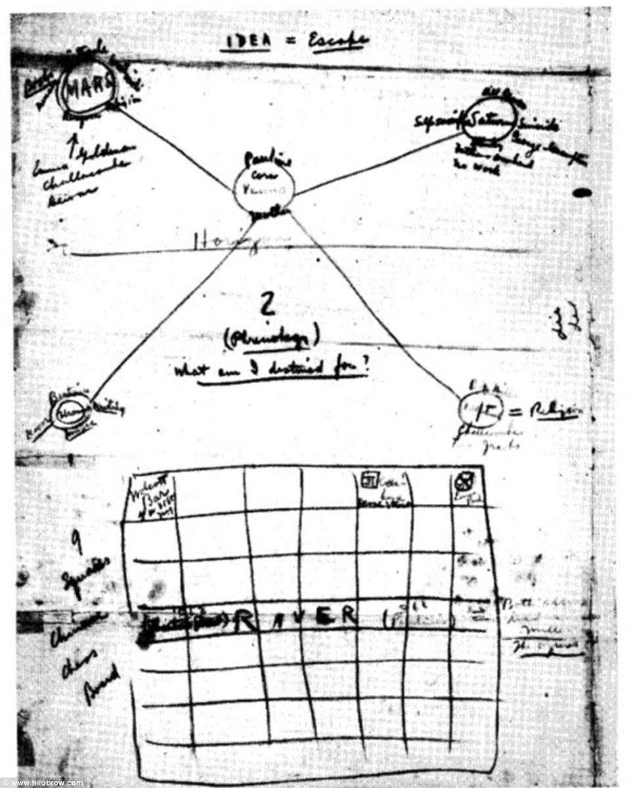

# Becoming Genius

## Episode 2–Understanding

**Transcription**

Dev Priyānanda Svāmī Bhagavān

**Video Link:** [YouTube](https://www.youtube.com/watch?v=PT6_KOajMXA)

## Learning by Being

So if you’ve come with us this far, you know that the most effective method of learning is **learning by being**. And being requires **change**; that’s called **becoming**. And the first step to becoming a **genius** in whatever field you choose is **duplication**.  

Now if this doesn’t make any **sense** to you, you didn’t watch the first two videos. Go back and do that now—[here’s the link](https://www.youtube.com/playlist?list=PL8s1kPtHmCZKSDrnl37T9M163BHPUSOr5)—and **then** watch this video. Otherwise without the preliminaries, you’ll be grasping for the meaning.  

So what we’re doing here, is we’re learning by **becoming**. **Being** is the best way, because it comes from inside of you **spontaneously**. There’s no **script**. It’s not necessary, because you **are** the thing that you’re trying to be. You **are** the **genius**, the **master** of the subject that you’re trying to learn.

So, if you’re not **already** that genius, how do you **become** that genius? The first step is **duplication**. You must be working from an **exact copy** of the source materials. The second step, however, is **understanding**.

## What is Understanding?

Now what is **understanding**? When we’re with someone that we know, and that knows us really well, we can say, “We **understand** each other.” It means we really **know** each other; it means, “We have internalized each other’s **being** to such a degree that we can **predict** the effect of any word or incident on your consciousness.” Isn’t it? And that’s a very pleasant feeling of **intimacy**. We have a saying: “I **get** it.” “I **get** you, I know what you’re **getting** at.” What is it that you’re **getting**? You’re **getting** the **duplication** of the other person’s mind.

So this concept of duplication is very powerful, and it’s **fundamental**. If you’re not working with an **exact copy** of the original thing that you’re trying to learn, how can you learn it? And we’ll get into the **exact standard** of duplication later; but it’s much higher than you have been trained or led to **believe**.

Real duplication means an **exact copy**. And how that’s possible? By **knowing the definitions** of all the terms and symbols used in the original material. You should be able to **recite** the definitions by heart. That’s how well, that’s how **down-cold** you have to have your original material.

This is not an **exaggeration**. That’s why real students of a subject can quote **verbatim** from the source materials. Then by **modeling** the **meaning** of those source materials in a **cause-and-effect** relationship, you come to **understand** it: “I do **this** over here, and it causes **this** over here. I tweaked **this**, and it does **that**.” And there’s a cause-and-effect relationship in time.

## Telling a Story

So what we’re doing here by developing **understanding** is actually **telling a story** about the subject that we’re learning. It’s like constructing a **narrative** based on the material that you’ve duplicated, that describes **how** **the thing works**: the theory of operations, if you will. But the actual **process** that goes on inside your mind is one of **modeling**, and modeling in terms of **cause-and-effect**; building a **narrative**, building a **story**. And we’ll go through all the stages on how to do that.

But first we’re going to **review** some of the materials, some of the **concepts** from the previous video, just to **embed** it even **further** in your understanding, because that’s how this works. **Practice** means making something happen, and doing a **lot** of it—making it happen **again** and again and again. And then going back over it and becoming familiar with every **step**, every **phenomenon** involved in that doing, until you are completely familiar with **all** the range of cause-and-effect within that phenomenon. Then we can say we really have **understanding**. How do we **get** that understanding? Let’s go back and review the theory once again.

## Learning by Becoming

You remember we started off from the premise that the most efficient way of learning is to **change your being**. And in Buddhism this is called **becoming**. Actually the same word means both **being** and **becoming**, **_bhāva_**. So by becoming, we **become** the thing that we want to learn.

In other words, don’t just **learn** about medicine: **become** a doctor. Don’t just learn about music: **become** a musician, and **master** whatever your subject is. Whatever your object is, you want to **become** that thing **so thoroughly** that you don’t have to **think**, you don’t have to **calculate**, you don’t have to consult reference books or look it up on Google. You **know**, and you respond because you **are** the **master**.

This is the technique that we’re giving, which has never really been understood well in the Western world. So you have to start from **thorough grounding** in the **rudiments** of whatever it is you’re studying—especially the vocabulary, because the vocabulary is what gives you the **name-and-form** of the being that you’re trying to attain. Let’s go over it one more time.

## Dependent Origination

Becoming is a process called **Dependent Origination**. That means each step of the process is **dependent** upon the step that goes before it. So from **ignorance** is coming **fabrication**; from fabrication is coming **consciousness**, from consciousness is coming **name-and-form**, and so on, until you get down to **birth, aging-and-death**, and **suffering**.

Then, once someone bottoms out in suffering—well, the next stage is for them to take up the **Eightfold Path**, the **end** of becoming. And we’re going to get to that after we go through **mastering** the process of becoming. Because the Eightfold Path is **also** a process of becoming, it’s just one that leads to enlightenment, Nibbāna (_nirvāṇa_) and unbinding: the **end** of suffering. So we’re going to learn both sides of this figure, the left side first.

In our study of becoming, for applications like learning and leadership, we are especially interested in **this** part of Dependent Origination. And we call this in our materials **The Process of Becoming**. It’s not all the stages, but **most** of the stages of Dependent Origination. For the purpose of investigating learning as a process of becoming, we will divide the stages a little differently. We divide the stages into four: **duplication, understanding, analysis** and **metacognition**.

## Terms and Definitions

Now why do we concentrate so much on terms, words and definitions? Because the stage of **name-and-form** and the stage of **consciousness** have a **feedback loop** between them. You cannot separate them, really; it’s almost artificial to make them into two stages, because they’re basically one and the same thing. You could look on name-and-form as a **gate** on consciousness. In other words, the name-and-form that You have labels for, is what you’re going to be conscious of. And if you don’t have labels—if you don’t have a name or a form for a particular phenomenon—you won’t be conscious of it, even if it’s right in front of your nose.

Let me give you a great example: when the Spanish Armada laid anchor off of the coast of South America, the natives—the Mayans and the Incans—**did not see it**. It was **invisible** to them. They could not see it, because they did not have a **category**, in their set of name-and-forms, for **ocean-going vessels**. They did their best to just shut it out of their consciousness and ignore it. And then, when the Spaniards came out in their **armor**, mounted on their steeds, this really freaked the Mayans out, because they didn’t have a concept for that either in their name-and-form. Yet these guys were showing up and killing them.

It would be just like as if—I don’t know—some aliens from outer space started killing people with nanoweapons, or something that we have no name for. At first, people wouldn’t want to believe it was happening. They wouldn’t see that it was happening; they would see something **else**. They would call it something that was **already present** in their network of names-and-forms, in their ontology. And we’re going to get deep into ontological analysis in the next video. Right now we’re just laying the foundation, laying the groundwork for that analysis.

Duplication is a somewhat **tedious** process. I know, you have to look things up in the **dictionary**, and **nobody** wants to do that. I had one student who I was telling, for over a year—I think it was about a year and a half—“You have to clear your definitions in the dictionary. You have to clear, you definitely…” He wouldn’t do it; he just **wouldn’t do it**. Of course he was like the slowest student that we had in the _āśram_ in India.

Finally after a year and a half, one day he came to me and he said, “Wow, I just had the most incredible experience!” I said, “What did you see, God or what?” haha. He said, “No, I looked up some words in the **dictionary** and it’s like, everything is **clear** to me now!” And I’m going, “That’s what I’ve been **telling** you for a year and a half, since you got here! That the **first** thing you have to do when studying something is **look up the terms**; then everything else is clear.” Let’s put it this way: you can bang your head against the wall studying a subject for **years**, and not make as much progress as you can make in a **week or two** by identifying all the **unique terms** or **uses of terms** in that subject, and looking up their definitions in a **good dictionary**.

This is my experience. Mostly it’s going to be outside of your ontology, outside of your name-and-form. Because everybody knows, the teacher is going to tell us to look up the words, and we don’t want to do it **because** the teacher told us, right? Duh! You know, sometimes teachers actually **know** something. In this particular case the teacher’s right. And if you did this, you would find that 90% of the confusion of a subject would just **melt away**, and the rest will melt away when you get **experience** of the thing they’re talking about.

What we’re doing when we’re duplicating, getting all the terms defined, and then setting up a structure of terminology and analyzing it—we’re actually **creating the name-and-form** of the **being** of that subject. If you want to become a **doctor**, what’s the first thing you have to do? Learn anatomy. And what is anatomy? It’s simply a bunch of **terms** for stuff that we know already about our own bodies, but don’t have words for. Similarly if you want to learn **music**, what’s the first thing you do? Learn about quarter notes, eighth notes, half notes, ABCD and so on.

This is **vocabulary**, this is **terminology**, this is the technical, what is called a **terministic screen**, upon which we project our awareness. And if there is no category or name-and-form for our awareness to land on, **it doesn’t land**. And we are **unaware** of that phenomenon until we develop a terminology or a category of meaning for it.

First, communication depends on language. We talked about communication last time. It means making a copy, a duplication of what’s in someone else’s mind, in your mind. That’s learning, one phase of learning, **duplication**. Communication depends on language, and we can be **conscious** of something **only** if we have a description of its name-and-form in our **ontology**.

And like I said, we’re gonna go into ontology very deeply in the next video. Right now we’re laying the groundwork, laying the foundation for the study of ontology in learning, and it just gets better and better, you know? **Duplication** is kind of a **slog**; it’s a little bit tedious. And what we’re going to be studying now in **understanding** is also a bit tedious and mechanical. But once we get to **ontological analysis** you’re going to be amazed how it’s going to **fly**. So this whole thing depends on having definitions for all the important terms in your subject. Once you have **that** established, everything goes like a **dream**, it’s amazing.

## What is a Genius?

What is a genius? Genius is defined as “Exceptional intellectual or creative power or other natural ability; a person who is exceptionally intelligent or creative, either generally or in some particular respect.” The example they give is, ‘a musical genius’. But I don’t agree with this definition, that genius is a natural ability. They seem to indicate that it can’t be cultivated; it has to be inborn—and I don’t accept that at all.

I am an expert in multiple fields at a high professional level of competence, but I don’t feel myself to be extraordinarily intelligent. I mean, there were some times in my life when I was highly trained in a particular subject or activity; for example, music. And I could sit down and just sight-read anything you put in front of me. I felt like a genius when I was doing that; but I knew from my own experience I had trained up to do that over many years of hard methodical practice. So to me, it didn’t seem like anything special.

It’s just like a person, if you do any kind of weight training or exercise, you start out the first day very light; then over time you gradually become stronger and stronger until you can do amazing things that that blow other people’s minds, huh? But to you it’s **normal**, because why? You do it every time you work out! When I started jogging, I could barely get around the track one time. After a while I was jogging routinely five miles every morning. It was nothing, it was ordinary, because it was something I did every day.

So the same way, if you train how to become a genius in your particular field, whatever it is, even if you are of ordinary intelligence—which by the way, I think everybody is actually of ordinary intelligence. And either you train in the kind of things that IQ tests test for, or you train yourself in other things, like how to be popular in high school—and you miss all the academic stuff, and then you wind up thinking that you’re **dumb**. Now, you’re not dumb, you just tried to apply yourself in the wrong direction, in a **temporary thing** that doesn’t yield any really beneficial results. The nerds in high school actually got **more** out of it than you did. Why? Because the things **they** learned benefited them later on when they went to college and in their careers. Becoming popular you can learn **anytime**. Try to understand. We’re helping you lay the foundation for success in life in any field, becoming a genius in any field.

Now let’s see, how is that possible? Let’s define Becoming Genius as follows:

> “**Becoming Genius** uses concepts derived from the teaching of the Buddha and other spiritual disciplines, as well as advanced concepts in science, education, ontology, semantics, software and Systems Theory, to **master** any subject **so thoroughly** that it results in a **permanent change in being**, so that whatever you master becomes your **spontaneous natural self-expression**.”

Now you should look up all the important words in this definition; especially **ontology, semantics, systems theory**, and like that. But especially, you should understand that the thing that gives you **mastery as a spontaneous self-expression** is **being**. And being is not just one thing, it’s a collection of **many** things that form a kind of background, or a kind of **context** to your consciousness. And this is **name-and-form**, the process of **Dependent Origination**.

The Buddha called it name-and-form because in those days they didn’t have words like **ontology**. Those were invented later, by the Greeks actually. But the Buddha **used** **ontology** in his teaching, he used **semantics** in his teaching. He was a very expert **wordsmith**, and he utilized semantics to create a **network of terminology** that could explain the **changes in consciousness** that he was trying to share.

So the Buddha is the pioneer, actually, in the **creation of specific states of consciousness** by making a set of terms, a name-and-form for those states, that actually helps you attain that level of being. So actually, we can do that not only for states of consciousness; we can do it for almost anything, and that’s what this course is all about.

The four stages of **Becoming Genius** for any given subject are: 

- **duplication**: making an exact copy of the source
- **understanding:** systems thinking through logic—and that’s the stage we’re discussing today
- **analysis:** contemplation of abstract relationships, also known as **ontology** 
- **metacognition**: realization of a **new state of being**

I’m trying to think of a good example for **ontology**, and how it influences **consciousness**. Did you ever go to a movie, an action movie; and then, Bruce Willis or whoever the action hero is, is doing all these incredible feats, and beating all these guys up or whatever. And you walk out of that movie feeling like “Yeah!” You’re ready to take on the world. **Are** you, really? Probably not, but you **feel** that way because watching 90 minutes or two hours of Bruce Willis surviving the most incredibly dangerous situations gives you the confidence that, “Hey, maybe **_I_** could do that too.”

What is that? That’s name-and-form creating consciousness, or gating consciousness in such a way that you feel you could actually **duplicate** some of those crazy stunts. Don’t try this at home, kids; you probably can’t, but it makes you **feel** like you could. And actually you **could** if you **trained** for it; **anybody** could. If you have the **time**, the **energy** and the **facility** for that kind of **training**. That’s really the difference between you and Bruce Willis, or any actor; or you and a great musician or a great anything: simply **methodical training**.

## What is Understanding?

Now, what is **understanding**? The subject of this video. The dictionary defines understanding as a noun: 

> “the ability to understand something; comprehension; the power of abstract thought; intellect; an individual’s perception or judgment of a situation.” 

So the ability to **understand** something is really what we mean by **duplication**. If you can **duplicate** something, if you can make an **exact copy** of it in your own mind, and **analyze** it to see how it works, you pretty much **understand** it. You know how to **do** it. Now, they take it a little higher: **comprehension**. Comprehension actually means **understanding how it works**. I **comprehend** the activity or the working of a computer, for example. I know **how** the whole thing **works**. I used to work in the computer industry, and I understand RAM, ROM, code, operating systems, the whole bit. And I know pretty much how a computer **works**. That’s **comprehension**, as distinct from **understanding**. I understand this is a computer, and I know how to work it. If I really **comprehend** what a computer is, I know **how** it works and **why** it operates the way it does.

Then they say, “the power of abstract thought”. What is abstract thought? **Abstraction** means, taking information away from something until only the **essential** is left. And usually what you have then, is a set of **relationships**: **this** is higher than **that**; **that** is connected to this **other thing**; **this thing** is the cause of something else; if you do **this**, **that** will happen—and so on. Those are **abstract relationships**. And in our next video on analysis, we’re going to get really into this.

**Intellect**: well of course _intel_ means **intelligence**, and _actos_ means **work**. So **intellect** means **working** with **intelligence**. Working with intelligence is **completely** different than working with brawn; it’s **brains** instead of **brawn**, producing an **effect** through the **action** of intelligence. This is much more efficient than physical work. Why “The pen is mightier than the sword”? Why do we say that? And if we see in history, it’s true. It may not appear to be true in the moment, but over a long span of time, intelligent people get **paid** more, they have more **status**, more **power**, and so many other things than, you know, people who work with their hands, for example.

Well, why is that? Because intellect is a more **efficient** way of working; it’s working with **relationships** and **qualities** of things instead of the **physical** being. So, not that intelligence is **everything**, but it’s one of the **most** important things when it comes to making our work and life **efficient** and **successful**.

And finally, understanding is an individual’s **perception** or **judgment** of a **situation**. **Situational awareness**—what is the **meaning** of this **situation**? You’re walking along the street and somebody says, “Psst! Hey buddy, wanna buy some **software**?” Well, maybe it wouldn’t happen walking along the street; maybe it happened on the internet. “Hey buddy, want to download some **free software**?” What are the odds this download has got some **virus** in it, or some **malware**? What are the odds that maybe it has a **backdoor**, you know, for the **NSA** or something. Pretty good. Why? Because this is an **attack vector**; this situation is **designed** to allow you to **suspend your judgment**. You suspend your good judgment: “Well, wait a minute. I’m not getting this from an authorized source; so it could be **contaminated** with something, it could carry a **payload** that I’m not **bargaining** for here.”

You see, every situation has a **strategy** to it; every situation has a **meaning**. If I’m in an airplane, and suddenly the airplane adopts some unusual **attitude**, I know I better start **worrying**. If you know **airplanes**, if you know **flying**, if you know **when** the plane should turn and **how** it should turn, you know, if you study your **plats** of your airport approaches, and you know how the plane’s going to come in, what **beacons** it’s going to fly over, and so on like that, you can actually **track** your flight pretty closely. But if it **deviates** from that pattern, then you know there’s some **problem**, there is some **issue**.

This is the **meaning** of things: the plane assuming an unusual attitude is the **situation**, but the **meaning** of that situation is something **beyond** the immediate situation. It has to do with **context**, the **background** that we bring to awareness of a particular situation. And **mastery** is all about **context**. In fact, you could say, you could even **define** mastery as **the creation of a context that uses you**.

You know, normally when we do intelligent work, **we** use the information, **we** create the context, **we** give the meaning to the situation. But in a situation of **mastery**, when you’re in a **condition** of mastery, it’s the other way around: **the context uses you**. That’s why we say it **becomes your natural self-expression**, your **spontaneous response** to a given situation. You don’t have to **think** or **calculate** because you have the **being** of that kind of **thing**, you have the **context that uses you** in that situation.

Any highly-trained musician, for example, **knows**. He **experiences** it: when the conductor gets up on the podium and raps his baton, immediately they get ready to play, whatever it is. They don’t even think about it. Why? Because as expert musicians, the **context** of **expert musicianship** is **using them**. So similarly, if you become **expert** at anything, if you become a **genius** at anything, the **context** of that being is going to **use** **you** to **be** that thing. And that’s **expertise**, that’s **genius**, that’s **mastery**.

So how do we get there? By **creating** the **name-and-form**—not any old way, but in a **specific** way that leads to **mastery** of that particular field. That’s what we’re doing.

Now for the purpose of **Skillful Living**, **understanding** means to **apply your intelligence** to a subject, to comprehend **how it works**. This means building a **dynamic model** of a subject, that incorporates **cause-and-effect**. This is **how** you attain understanding.

Now, what’s the relationship between **understanding** and **duplication**? In the previous video of this series, we presented the technique of **duplication**. Duplication is **prerequisite** to understanding, because working with an **imperfect** or **incomplete** copy of the source material only leads to **errors in understanding**. It’s just like if you download a program from the internet, and there’s some error, and the software won’t run; or if it does run, there’ll be some errors in the output. Maybe it’ll crash your computer, who knows? So if we start thinking or analyzing from an **imperfect copy** of the original source material, how are we going to come up with the correct results? It’s not possible. It’s very, very important that we start with a **clean copy**, a **perfect duplicate** of the original material—assuming that the original material comes from an **expert**. By the way, that’s one of the things we’re going to analyze in our **ontological analysis**: make sure that the material we’re studying actually contains all the information that we need to become expert.

So we have to make a **duplication** of that information, and then begin to **analyze** that to see the cause and effect. In fact, the process of understanding is one of the best ways to check the accuracy of duplication. If your standard of duplication is good, you will have little trouble building an understanding of the subject. **Difficulty in understanding** is a sign of inaccurate or incomplete duplication. Just like your computer crashing or other errors is a sign of some error in copying the software from the source. If you have an error in a definition of an important term, your **model** won’t work, your **analysis** won’t work, it won’t come up with correct **results**; your situational awareness will **fail**, you’ll get the **wrong answer** or you won’t be able to **perform** the task or whatever it is. That’s a sign that your duplication is incorrect, and you have to go back and retread your **fundamentals** in the subject.

The actual **standard of duplication** is that you can **recite the definition** of each word and symbol appropriate to its context. If you can’t do that, **your process of duplication is incomplete**. This is the **actual standard** of duplication: that you can **recite the definition** of each and every term—especially the **small relationship words** such as, if, than, for, such, act, around, up, down, in, out—all these words have **dozens** of definitions. Look in the dictionary: you should be able to **recite** the proper definition according to the **context**.

One of my favorites is **up**: “Fill the car **up**.” “What do you mean? Fill the car on the ceiling? What are you talking about?” No, **up** in that context means “in or into a condition or position of fullness or completion.” I memorized the definition because we **use** that word so many times without **any** idea what it actually means: “Do it **up**;” “Roll it **up**;” “Light it **up**;” “Fill it **up**.” And what it really means is, “into a condition of fullness or completion.” So there are many, many small words, in the English language especially, that have numerous, sometimes even conflicting meanings, depending on the context. You have to sort this out; I can’t do it for you.

## Methods for Understanding

Now we’re going to look at some methods for understanding. Some **workable methods**—what do I mean by workable? Practical, that they actually **give** the result that we’re looking for: **outlining, handwriting, diagramming, clay modeling, mind-mapping** and **building an ontology**.

Why are these workable methods, and maybe some other things, like just reading, aren’t? You want to get away from the pure **significance**—the pure information of the terms—and you want to start bringing that significance into **manifestation**. This is the **process of becoming**, so the best way to do that is to take that original material, once you’ve made a copy of it in your own mind. Then **without looking** at the source materials, to begin to manifest that by writing. And I mean **handwriting**.

Writing with your own hand is very powerful. It’s extremely potent, especially when dealing with abstract subjects like math. Don’t use a computer for that, don’t use _Mathematica_ or whatever. It is much better to write it by hand, **then** do it on the computer to make it neat. Why is that? Because you begin to **engage the senses** of your physical body in the process of obtaining the knowledge, obtaining the skills. You begin to bring the thing **into manifestation**. It’s not just name-and-form anymore; now its **senses**. Remember, Six Senses is one of the stages in the process of Dependent Origination. So when you bring a subject from a name-and-form into the senses, you begin to **make it yours**. You begin to change your being physically. You begin to **wire those connections** into your neurons, into your brain, into your very muscles and bones. And this is why physical training is so much important in skills like music, and other things that are **performance** type of skills. But even for strictly knowledge-based skills, like math for example, the writing out of the formulas, the writing out of the philosophy if you’re studying philosophy, diagramming the thing or clay modeling it, will give you a much, much better **comprehension**; much, much deeper **understanding**; and actually train you to **use** the thing, to become an expert at it in a **practical** way.

The first **workable method** for building understanding is **outlining**—making an ordered, prioritized list of points. The dictionary defines **outlining** as “**making a general description or plan giving the essential features of something but not the detail**.” Any word processing software can be used to generate an outline, but we suggest that you **write it by hand**. Handwriting engages additional senses (including the kinesthetic sense) in the process of understanding. It also helps you to identify points that need more work.

You were probably taught to outline in Harvard style, but it doesn’t have to be that way. Here’s an outline for the novel _Catch-22_ by Joseph Heller, and you see it’s in spreadsheet form. And this novel is densely plotted, complex, lots of characters, lots of actions. So he puts it in the form of a spreadsheet. You notice all the cells that are erased; it’s in pencil, and I recommend using pencil too.

Speaking of creative outline formats, here’s Henry Miller’s manuscript plan for _Tropic of Capricorn._ As you can see, it doesn’t look anything like a traditional outline, and yours doesn’t have to either. You can put charts in there, you can put drawings—anything that makes sense to **you**, to make sense of the **subject** that you’re trying to wrap your mind around.

Here’s an outline from JK Rowling for one of her Harry Potter books, I don’t know which one. And as you can see, this one’s done in ink but it’s the same type of chart layout that Joseph Heller used for his books. This works for a lot of different subjects besides literary novels, though you can try it on anything that’s **analytical**, that has a lot of **categories**; it’ll work great. now

Here’s an interesting one. This is Gay Talese’s outline for his profile on Frank Sinatra. It’s done in magic marker: all kinds of different colors, sketches, weird shapes and arrows. It’s like, whatever works for you to get your idea **out of your head** and onto paper **manually**. Don’t use computer programs: write.

Now let’s talk a little bit about **clay modeling**. A very useful and **workable method** for building understanding is **clay modeling**. Most people have never encountered it, so give it a try. You might think it’s silly—‘only kids do that’—but it is very powerful. It works on the principle of exchanging **significance** for **mass**, getting the concept **out of your head**, and allowing you to physically manipulate and play with it. You don’t have to use clay: wooden blocks, nuts and bolts, or any odds and ends will do, as long as you **label them** properly.

Now, here’s a short demo of clay modeling. We’re going to use ordinary modeling clay—you can buy in any toy store or stationary store very cheaply—to demonstrate the process of planetary transits in astronomy. OK? So what is a planetary transit? Here we have the Sun and the Earth. You can tell that’s the Earth because it has a label. And then you have the moon going around the earth. OK, so every so often the moon comes around in between the Earth and the Sun. That just happened a couple of weeks ago; when we made this video we had an eclipse of the Sun. So when the Moon moves across the face of the Sun from the Earth’s point of view, that’s called a **transit**. Sometimes, Venus also does the same thing. Let’s make the scale a little bigger here. Sometimes Venus goes between the earth and the Sun in such a way that it crosses the sun’s disc, and that’s called a **transit of Venus**.

Now a transit is also a conjunction—in other words, the conjunction means that the planet and the Sun—Venus and the Sun—are in the same direction. It happens with the moon too. When the moon is in the same direction as the Sun you have a conjunction between them. What’s the difference between a conjunction and transit? A conjunction doesn’t necessarily mean that the moon moves in front of the Sun and covers it, or that Venus moves in front of the Sun and covers it. A conjunction means that they’re simply in the same direction.

Now what about the outer planets? Let’s put Mars here. Now do we ever have a transit of Mars? Well yes, if there’s any planets out beyond Mars, and Mars happens to move across the face of the planet, like Jupiter let’s say, that would be a conjunction—I mean, sorry a transit of Jupiter by Mars. So this can happen both towards the Sun and away from the Sun.

This is just a very simple demonstration to give you an idea of what a clay demo is all about and how using a clay demo can actually make the idea, the concept come alive. Because we can sit here and line these things up the way they would actually look. Like, here’s the Earth, and here’s the Moon going around, and the Moon actually goes in front of the Sun and that’s a conjunction—I’m sorry, a transit—or Venus actually going in front of the Sun. Has happened just a few months ago. So in that way we can model these things, get the ideas out of our head and into physical space where we can move them around and model the phenomena that we’re studying. It works with anything.

Now let’s quickly go over **mind-mapping**. Mind-mapping is another **workable method** for building understanding. Here is where software becomes very useful. You are building a network of concepts and terms, and showing the hierarchical connections and relationships between and among them. Mind-mapping is similar to outlining but more free-form.

What you’re really doing here is building a **taxonomy**—a network of terms expressing the elements of your subject—and beginning to map the relationships between and among them. Mind-mapping the important terms and concepts in your subject is a preliminary step toward **ontological analysis**, which we will cover in depth in the next video.

Here are some good **software tools** for mind-mapping. Take a look at _X-mind, MindNode, The Brain_—pricey but very powerful—_FreeMind_. And look up on Wikipedia.org the **list of concept- and mind-mapping software** complete with links to the software developers.

## Testing Your Understanding

Finally, let’s talk about **testing your understanding**. After employing the **workable methods** for building understanding that we have presented earlier, then it’s time to **test your understanding**. You should be able to **think through the subject** as a chain of **cause-and-effect**, from beginning to end. Try modeling different scenarios in your mind, and see if the conclusions you get **agree** with the **source materials** and **your experience**.

Since your aim in all this is to teach yourself a **specific** **skill**, the **ultimate test** of understanding is that you are able to **perform** the skill at a professional level of competence. This will take **practice**!

And here’s one of my favorite sayings: “In **theory**, theory and practice are the **same**; in **practice**, they’re **different**.” — Yogi Berra. Modeling, as powerful as it is, has to **assume** that the subject exists in **isolation**, as in a **laboratory setting**. That is the only way to reduce the number of variables to a manageable level. Be aware of your model’s **limits**! Your model can never be completely **perfect**, because in the real world your subject does not exist in **isolation**. It will be impacted by various situations and environments, with results impossible to predict with **complete certainty**. But—you **can** come very close.
